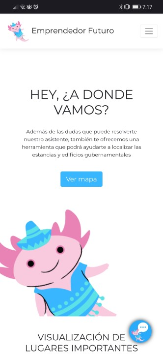

# AxolotlTeam-Emprendedor-futuro  
## **Sobre el proyecto**
Emprendedor futuro consiste en un [portal web](https://education.axolotlteam.com "Education AxolotlTeam") que permite conocer sobre el camino hacia el emprendimiento, va dirigido principalmente a alumnos y maestros de nivel superior, sin embargo, se busca tener un nivel que interacción sencilla que permita ser utilizado por el público en general.

Con nuestra herramienta se podrán conocer los siguientes aspectos:
* Conocimiento general sobre las PyME en México.
* Conocer las estancias administrativas importantes en tu región (Tijuana).
  * Documentación que se puede tramitar en dichos establecimientos.
  * Características de los mismos.
  * Requerimientos necesarios para los tramites. *
* Conceptos clave sobre emprendimiento.

_*Algunos trámites puedes estar sujetos a diferentes aspectos individuales, dichos casos deberán revisarse en la dependencia correspondiente._

## **Tecnologías**
Los servicios y características que utilizamos son los siguientes:
* _**Azure maps**_: Gracias a este servicio se puede [visualizar](http://education.axolotlteam.com/maps/ "VISUALIZACIÓN DE LUGARES IMPORTANTES PARA COMENZAR A EMPRENDER
") la localización de las estancias que se requieren conocer para poder comenzar con el camino del emprendimiento.
* _**QnA Maker de Azure y Azure Web App Bot Services**_: Gracias a esta tecnología se pudo presentar un [Asistente virtual.](http://education.axolotlteam.com/#asistente "Guiare tu camino hacia el emprendimiento") que estará disponible las 24 horas del día para poder resolver las dudas que se puedan presentar para cualquier persona que sueñe con emprender.
* _**django**_: Es un Framework de desarrollo web gratuito y de código abierto escrito en Python.
* _**Bootstrap Studio**_:  Conjunto de herramientas de código abierto para el diseño de páginas web.
* _**Heroku**_: Se trata de una plataforma en la nube que permite a las empresas construir, entregar, supervisar y alojar aplicaciones en la nube.

## **Implementación**
Para lograr tener una relación estrecha con los estudiantes, quienes son los futuros emprendedores, se busca llegar a los portales educativos. Gracias a esto, profesores de la institución podrán tomar como apoyo nuestra herramienta, en la cual se presentan las estancias a las que se podrían referir al momento de presentar una clase relacionada a requerimientos para formalizar el emprendimiento.

## **Escalabilidad**
Nuestra herramienta, al igual que otras, comienza en un entorno local (Tijuana B.C. México), sin embargo, se pretende implementar nuestros beneficios al resto del país y del mundo. Se buscará incorporar nuestro asistente dentro de las áreas de trabajo que las escuelas estén utilizando, como pueden ser Microsoft Teams, Google Classroom, Zoom, entre otros.

Respecto a los servicios que ofrecemos sobre emprender, solamente se trata del tema principal, ya que se podrán abordar soluciones para otros aspectos que también son importantes para los jóvenes, como pueden ser: mejorar la presentación de tu sitio web, reconocer lugares (a nivel mundial) para comprender una estructura de negocios internacional, entre otros.
